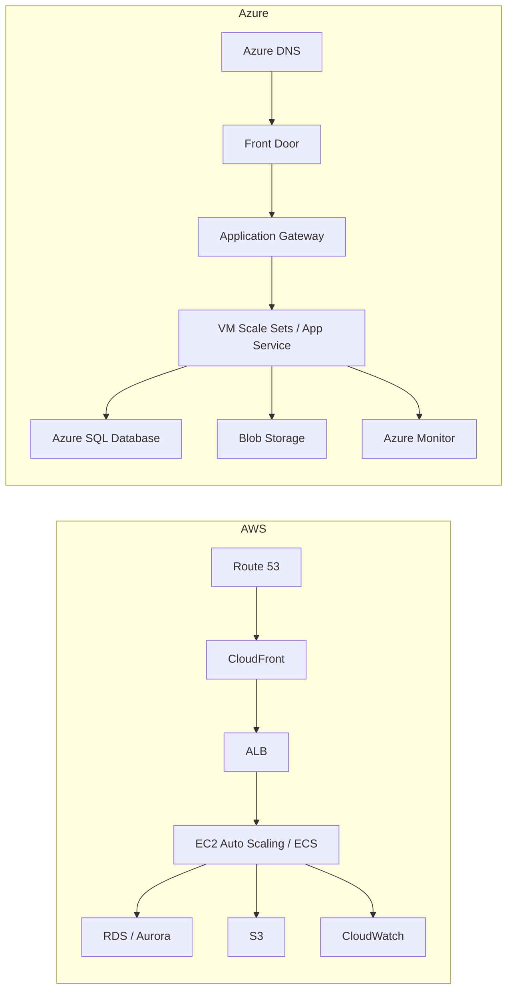
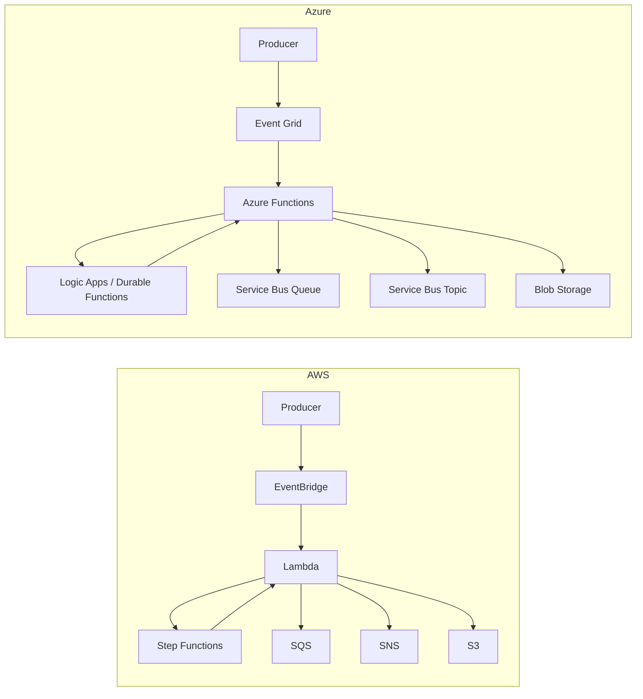
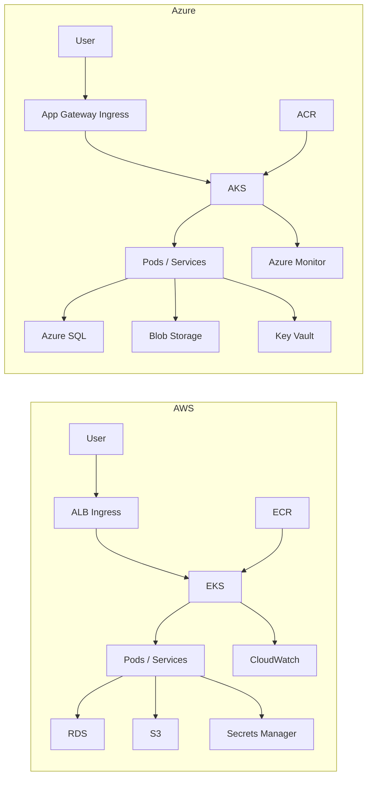
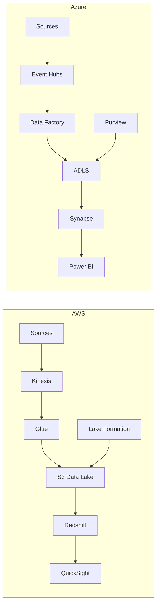
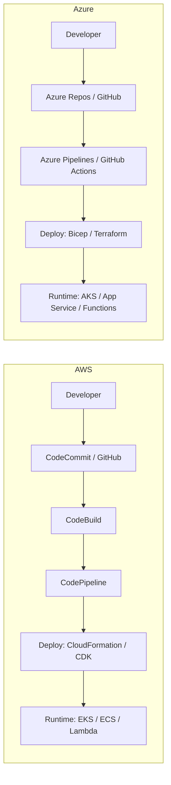
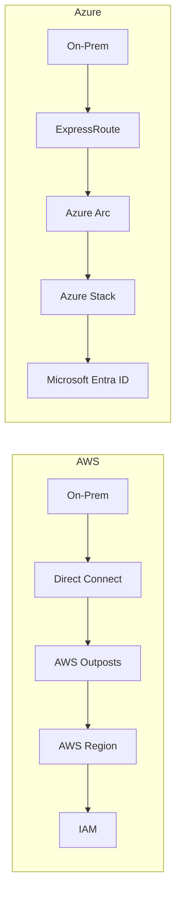
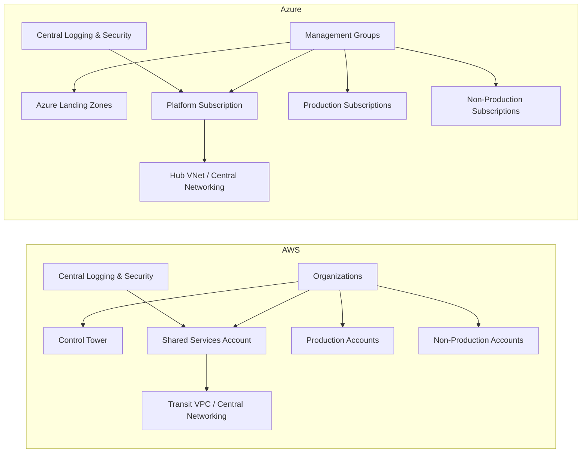

# AWS vs Azure  - Services

| Service Category                        | AWS Service(s)                       | Azure Service(s)                                        | Key Difference / Note                                                                                                          |
| --------------------------------------- | ------------------------------------ | ------------------------------------------------------- | ------------------------------------------------------------------------------------------------------------------------------ |
| **Compute (VMs)**                       | EC2                                  | Virtual Machines                                        | Both provide scalable VM compute.                                                                                              |
| **Auto Scaling**                        | EC2 Auto Scaling                     | Virtual Machine Scale Sets                              | Similar concept: scale VM instances based on demand/metrics.                                                                   |
| **Containers (Managed Kubernetes)**     | **EKS**                              | **AKS**                                                 | Both managed Kubernetes; Azure often feels more integrated with AAD/Entra and portal workflows.                                |
| **Containers (Managed container apps)** | ECS, App Runner                      | Container Apps                                          | Azure Container Apps is closer to “serverless containers”; AWS has multiple options depending on preference.                   |
| **Serverless Functions**                | Lambda                               | Azure Functions                                         | Event-driven code execution with deep integrations on both sides.                                                              |
| **Event Bus / Integration**             | **EventBridge**                      | Event Grid                                              | Both route events between services; Azure also commonly pairs Event Grid with Logic Apps.                                      |
| **Workflow Orchestration**              | Step Functions                       | Logic Apps, Durable Functions                           | Step Functions is workflow-first; Logic Apps is low-code-heavy; Durable Functions is code-centric orchestration.               |
| **API Management**                      | API Gateway                          | API Management                                          | Azure API Management is very feature-rich for enterprise policy/governance; AWS API Gateway is tightly integrated with Lambda. |
| **Messaging (Queue)**                   | SQS                                  | Service Bus (Queues)                                    | SQS is simple and scalable; Service Bus offers richer enterprise messaging features.                                           |
| **Messaging (Pub/Sub)**                 | SNS                                  | Service Bus (Topics), Event Grid                        | AWS commonly uses SNS+SQS; Azure splits responsibilities across services.                                                      |
| **Streaming / Event Streaming**         | Kinesis (Data Streams/Firehose)      | Event Hubs                                              | Both for high-throughput ingestion and streaming workloads.                                                                    |
| **Object Storage**                      | S3                                   | Blob Storage                                            | Both durable object storage with multiple tiers.                                                                               |
| **Block Storage**                       | EBS                                  | Managed Disks                                           | Persistent block storage for VM workloads.                                                                                     |
| **File Storage**                        | EFS, FSx                             | Azure Files                                             | Managed file shares; FSx supports specific enterprise file systems.                                                            |
| **Archive Storage**                     | S3 Glacier                           | Archive tier                                            | Long-term cold storage options.                                                                                                |
| **CDN**                                 | CloudFront                           | Azure CDN / Front Door                                  | Azure Front Door includes global load balancing + WAF patterns; CloudFront is CDN-first.                                       |
| **Networking (Virtual network)**        | VPC                                  | VNet                                                    | Core isolated networking constructs.                                                                                           |
| **Load Balancing**                      | ELB (ALB/NLB)                        | Load Balancer, Application Gateway                      | AWS splits L4/L7; Azure uses separate products (App Gateway is L7 + WAF).                                                      |
| **DNS**                                 | Route 53                             | Azure DNS                                               | Similar DNS hosting; AWS also includes health-based routing patterns via Route 53.                                             |
| **Private Connectivity**                | Direct Connect                       | ExpressRoute                                            | Dedicated private network links from on-prem to cloud.                                                                         |
| **Relational DB (Managed)**             | RDS, Aurora                          | Azure SQL Database, Azure Database for MySQL/PostgreSQL | Azure SQL is strong for SQL Server ecosystems; AWS offers breadth of engines and Aurora variants.                              |
| **SQL Server (Lift-and-shift)**         | RDS for SQL Server / EC2             | SQL Managed Instance                                    | Managed Instance is often positioned for near-full SQL Server compatibility.                                                   |
| **NoSQL (Key-value / document)**        | DynamoDB                             | Cosmos DB                                               | Both globally distributed; Cosmos offers multiple APIs; DynamoDB is key-value/document with strong AWS integration.            |
| **Cache**                               | ElastiCache (Redis/Memcached)        | Azure Cache for Redis                                   | Similar managed caching patterns.                                                                                              |
| **Search**                              | OpenSearch Service                   | Azure AI Search                                         | Comparable managed search; naming/features differ.                                                                             |
| **Data Warehouse**                      | Redshift                             | Synapse Analytics (Dedicated SQL pool)                  | Both analytics warehouses; Azure often combines Synapse with broader data integration tools.                                   |
| **ETL / Data Integration**              | Glue                                 | Data Factory                                            | Both orchestrate/transform data pipelines.                                                                                     |
| **Data Lake Governance**                | Lake Formation                       | Microsoft Purview                                       | Both focus on cataloging, governance, access control.                                                                          |
| **Identity & Access**                   | IAM, IAM Identity Center             | Microsoft Entra ID                                      | Azure identity is deeply integrated with Microsoft 365 and AD.                                                                 |
| **Secrets Management**                  | Secrets Manager, SSM Parameter Store | Key Vault                                               | Similar secure secret/cert/key storage.                                                                                        |
| **Key Management (KMS/HSM)**            | KMS, CloudHSM                        | Key Vault, Managed HSM                                  | Both provide KMS and HSM options.                                                                                              |
| **Monitoring/Logs**                     | CloudWatch                           | Azure Monitor / Log Analytics                           | Similar observability stacks with metrics, logs, alerts.                                                                       |
| **Tracing / APM**                       | X-Ray                                | Application Insights                                    | Distributed tracing and application performance monitoring.                                                                    |
| **IaC**                                 | CloudFormation, CDK                  | ARM, Bicep, Terraform                                   | AWS CDK is developer-friendly; Azure pushes Bicep + Terraform commonly.                                                        |
| **DevOps / CI-CD**                      | CodePipeline/CodeBuild               | Azure DevOps, GitHub Actions                            | Azure DevOps is a full suite; AWS tools integrate well with AWS-native deployments.                                            |
| **Registry (Container images)**         | ECR                                  | ACR                                                     | Both host OCI container images with identity integration.                                                                      |
| **Hybrid / Multi-cloud Management**     | Outposts                             | Azure Arc, Azure Stack                                  | Azure Arc is widely used for multi-cloud/on-prem resource governance.                                                          |
| **Edge / Device / IoT**                 | IoT Core, Greengrass                 | IoT Hub, IoT Edge                                       | Similar device ingestion + edge compute patterns.                                                                              |

# AWS vs Azure – Reference Architectures

---

## 1️⃣ Three-Tier Web Application

---

## 2️⃣ Event-Driven / Serverless Architecture

---

## 3️⃣ Kubernetes / Container Platform

---

## 4️⃣ Data & Analytics Platform

---

## 5️⃣ CI/CD Pipeline

---

## 6️⃣ Hybrid / On-Prem Integration

---

## 7️⃣ Secure Enterprise Landing Zone

---
